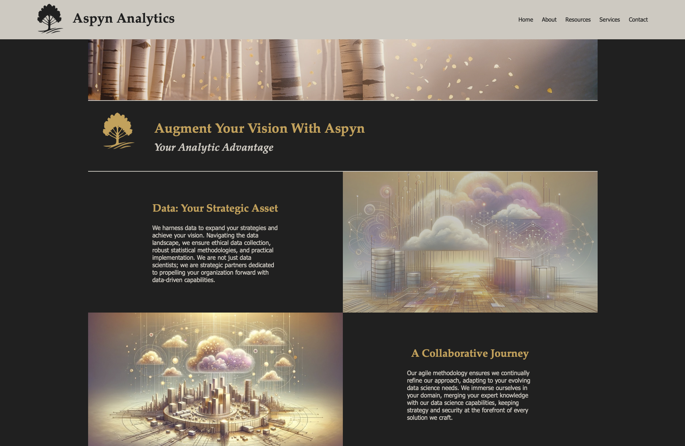
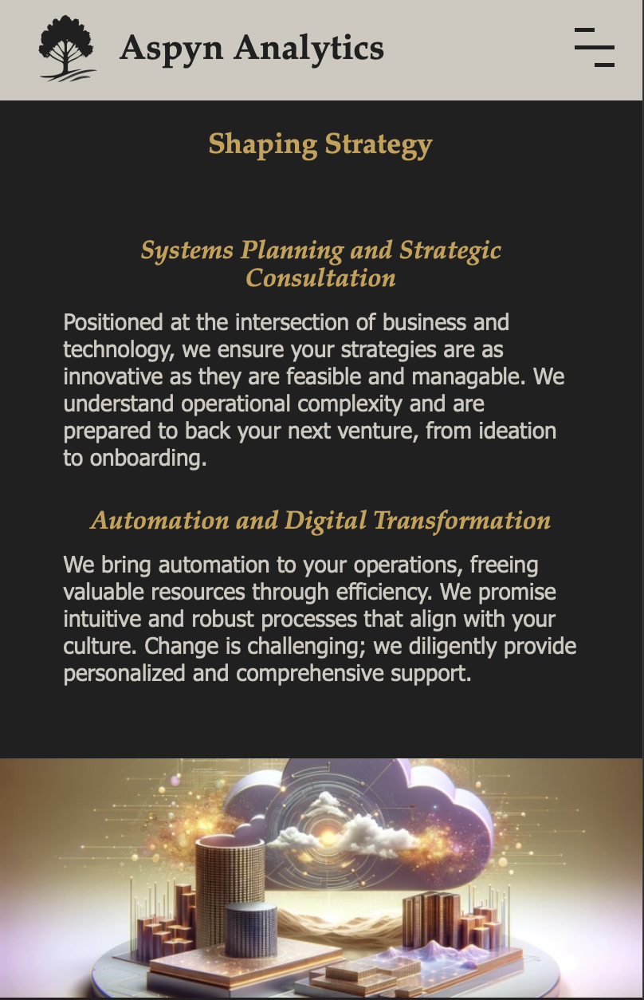

# Web Application for Aspyn Analytics Consulting Firm

This project is a full-stack Django web application featuring responsive mobile-optimized design, structured static file handling, and live deployment to a secured domain. 

This repository provides a sanitized demonstration, framed as the public-facing delivery for a fictional consulting client, Aspyn Analytics. The live deployment was based on a private production repository following real-world development practices.

Built with Django 4.2, custom HTML/CSS/JS, and deployed via Heroku infrastructure.

Visit the live deployment (secured HTTPS domain): https://aspynanalytics.com/

---

## Overview

This project delivers a fully responsive web application for a fictionalized consulting firm, simulating a real-world client engagement.

#### Client Use Case

Aspyn Analytics, a newly formed consulting firm specializing in analytics and data science, sought to establish a professional digital presence with:
- A clean, mature, subtly premium design aesthetic
- A modular, scalable site structure for easy expansion of planned site content
- Branding support (color scheme, logos, thematic imagery)
- Strong mobile optimization to showcase the site on tablets and phones during conferences
- Minimal technical overhead, allowing internal teams to update content without extensive developer support

This project simulates a real-world client engagement, delivering a public-facing web application aligned to these needs.

#### Delivery

This project delivers a fully responsive Django web application for Aspyn Analytics, simulating an end-to-end client solution.

Key outcomes:
- Modular Django 4.2 web app built for intuitive extensibility and low maintenance
- Mobile-friendly, responsive layout optimized for tablet and conference usage
- Custom branding package including logo design, color palette, and styling integration
- Efficient static asset management using Whitenoise middleware
- Secure live deployment via GitHub-to-Heroku pipeline with SSL and custom DNS
- Lightweight JavaScript enhancements for mobile navigation UX enhancement

The homepage was fully designed and implemented to production standards, while additional pages (*About*, *Resources*, *Services*, *Contact*) were scaffolded for future client-driven content population, showcasing a modular site architecture.

A live deployment of the application is available here (HTTPS-secured): https://aspynanalytics.com


## Features

#### Frontend Design
- Responsive homepage built with a 12-column CSS Grid system
- Dynamic stacking and reflow of content for mobile devices
- Mobile-optimized navigation with custom hamburger menu and click-off behavior
- Modular HTML/CSS component design for maintainability and scalability
- Dark-themed visual identity with custom brand-accented color palette and imagery
- Lightweight vanilla JavaScript UX enhancements (no external libraries)

#### Backend & Infrastructure
- Django 4.2 backend with ORM-driven structure
- Local development using SQLite, production-ready for PostgreSQL
- Static file serving and compression via Whitenoise
- Secure deployment pipeline through Heroku
- Private GitHub repository integrated with Heroku Continuous Deployment (CD) pipeline

#### Hosting & Security
- SSL/TLS-secured domain with HTTPS enforcement
- Custom DNS configuration for domain pointing (Namecheap/GoDaddy/Cloudflare analog, depending on your real registrar)
- Environment-variable based secret management (using python-decouple)
- Heroku resource configuration for stable runtime performance with lightweight dynos

---

## Application Interface

#### Desktop Layout

On larger screens, the homepage presents a multi-column layout with alternating text and image sections. Structured featured blocks introduce key themes (Your Vision, Our Approach, Capabilities, Call to Action), while strategic use of whitespace and curated imagery supports easy navigation and brand messaging.

<p align="center">
  
</p>
<p align="center"><em>Figure: Desktop homepage view.</em></p>

#### Mobile Layout

On mobile devices, the layout responsively stacks content vertically. The navigation collapses into a hamburger menu, interactive elements adapt for touch inputs, and imagery and text blocks resize appropriately to maintain readability and accessibility without external JavaScript frameworks.


<p align="center">
  
</p>
<p align="center"><em>Figure: Mobile-optimized view with responsive grid adjustment.</em></p>

---

## Technology Stack

| Component             | Technology                                      |
|:----------------------|:------------------------------------------------|
| Backend Framework     | Django 4.2                                       |
| Web Server             | Gunicorn                                         |
| Static Files Handling  | Whitenoise                                       |
| Environment Variables  | python-decouple                                  |
| Deployment Platform    | Heroku                                           |
| Frontend Styling       | Custom CSS grid (mobile-first responsive design) |
| Frontend Interactivity | JavaScript                               |

---

## System Design Details

- **Django Settings:**
  - Environment-driven secret keys and database configs
  - Secure HTTPS redirection and static file serving

- **Static Assets:**
  - Images, CSS, and JS organized under `mainapp/static/`
  - Whitenoise serves assets in production

- **Database:**
  - Configurable SQLite (dev) or external Postgres (production)

- **Deployment:**
  - Gunicorn WSGI server
  - `Procfile` for Heroku deployment
  - Heroku environment variables managed securely

- **Mobile Optimization:**
  - 12-column CSS grid with responsive collapse below 1050px
  - Adaptive banner resizing
  - Optimized font sizing and paddings for handheld devices

- **JavaScript Behavior:**
  - Toggling mobile nav menu
  - Closing dropdown menus on outside click

---

## Project Structure

```
consulting-firm-webapp/
├── aspyn/                    # Django project settings and WSGI application
├── mainapp/                  # Django app with views, templates, static assets
│   ├── static/               # Custom CSS, JS, and images
│   └── templates/            # HTML templates
├── assets/                   # Project documentation assets (readme images)
├── requirements.txt          # Python dependencies
├── Procfile                  # Heroku deployment configuration
├── manage.py                 # Django project runner
├── README.md                 # Project documentation
└── LICENSE                   # Project license
```

---

## License

This project is released under the **Creative Commons Attribution-NonCommercial-NoDerivatives 4.0 International** license. You may not use creative materials for commercial purposes.

---

## Acknowledgements

- Django: https://www.djangoproject.com/
- Gunicorn: https://gunicorn.org/
- Whitenoise: https://whitenoise.evans.io/
- Heroku: https://www.heroku.com/

---

> **Professional Note:** This project represents a mock consulting firm site, intended to demonstrate real-world client delivery. Any likeness to real commerical entitities is coincidental. It highlights both backend configuration and frontend design proficiency while maintaining production deployment standards.


